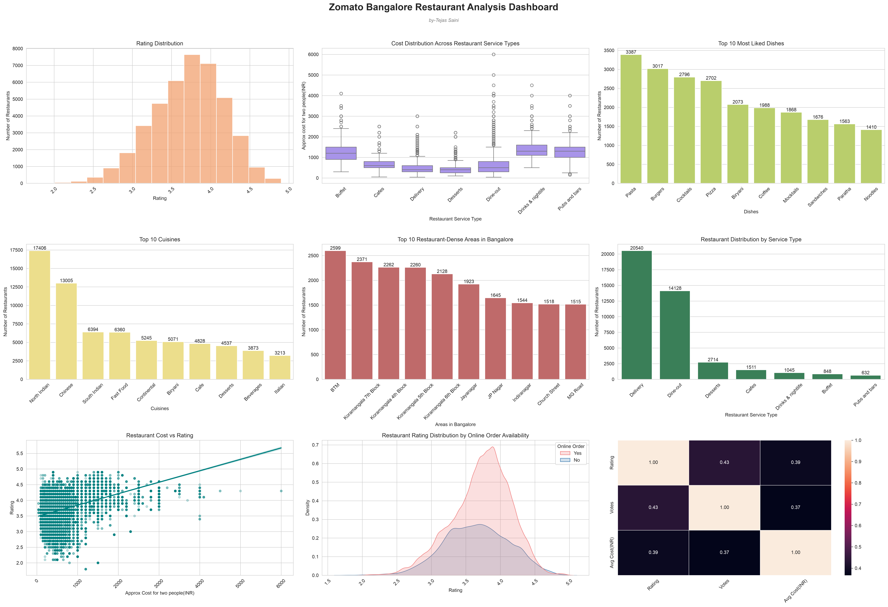

# 🍽️ Zomato Bangalore Restaurant Analysis (EDA)

## 📌 Project Overview

This project presents an **Exploratory Data Analysis (EDA)** of the Zomato Bangalore restaurant dataset using Python. The objective is to uncover meaningful insights into restaurant ratings, cuisines, pricing, locations, customer preferences, and service types through data cleaning, visualization, and business-focused storytelling.

The project demonstrates the complete EDA workflow—from preprocessing raw data to building a multi-visual dashboard that summarizes key findings.

---

## 🎯 Objectives

* Clean and preprocess the raw restaurant dataset.
* Analyze restaurant ratings and customer preferences.
* Identify the most popular cuisines and dishes.
* Explore restaurant distribution across Bangalore locations.
* Study pricing patterns and their relationship with ratings.
* Compare restaurant service types.
* Build a comprehensive visualization dashboard to communicate business insights.

---

## 📊 Dashboard

The final dashboard includes multiple visualizations to summarize the analysis:

* Rating Distribution
* Cost Distribution Across Service Types
* Top 10 Most Liked Dishes
* Top 10 Cuisines
* Top Restaurant-Dense Areas in Bangalore
* Restaurant Distribution by Service Type
* Restaurant Cost vs Rating (Regression Analysis)
* Rating Distribution by Online Order Availability
* Correlation Heatmap of Numerical Features

> **Dashboard Preview**



---

## 🛠️ Technologies Used

* Python
* NumPy
* Pandas
* Matplotlib
* Seaborn
* Jupyter Notebook

---

## 📈 Key Business Insights

* Most restaurants maintain ratings between **3.5 and 4.2**, indicating generally positive customer satisfaction.
* **North Indian** cuisine dominates the Bangalore restaurant market, followed by Chinese cuisine.
* Certain areas such as **BTM** and **Koramangala** have a significantly higher concentration of restaurants.
* Luxury-priced restaurants generally receive higher ratings, while budget and mid-range restaurants show greater variation.
* Popular dishes consistently appear across multiple restaurants, indicating strong customer demand.
* Restaurants offering **online ordering** tend to have competitive rating distributions.
* Cost alone has only a moderate relationship with customer ratings, suggesting that service quality and customer experience also play important roles.

---

## 📁 Project Structure

```text
Zomato_EDA/
│
├── zomato_restaurant_eda.ipynb
├── zomato_dashboard.png
├── README.md
└── requirements.txt
```

---

## 🚀 Skills Demonstrated

* Data Cleaning and Preprocessing
* Feature Engineering
* Exploratory Data Analysis (EDA)
* Data Visualization
* Statistical Interpretation
* Business Insight Generation
* Dashboard Design
* Data Storytelling

---

## 🔮 Future Improvements

* Develop an interactive dashboard using Plotly or Power BI.
* Perform customer segmentation and clustering.
* Build a restaurant rating prediction model using machine learning.
* Analyze sentiment from restaurant reviews.
* Create location-based visualizations using geospatial analysis.

---

## 👨‍💻 Author

**Tejas Saini**

If you found this project interesting or have suggestions for improvement, feel free to connect or leave feedback.
